Bede Iwuoha — Data Analyst & GIS Portfolio

📍 Portfolio First
This repository is my primary professional portfolio, showcasing real-world data analytics, business intelligence, and GIS projects with dashboards, reports, and analytical insights.

👉 Recruiters and hiring managers: start with the Flagship Projects below.

👤 Profile Summary (Main Bio)

I am a Data Analyst and GIS professional with a background in Surveying and Geoinformatics, specializing in data analysis, business intelligence, and spatial analytics. I work with structured and geospatial datasets to transform raw data into clear, decision-ready insights.

My technical focus includes Power BI, SQL, Python, Excel, and QGIS, with applied experience across agriculture, health, transportation, mobility, business performance, and workforce analytics. I am particularly interested in roles where data is used to support operational decisions, planning, and policy-driven outcomes.

🎯 Target Roles:
Data Analyst • Business Intelligence Analyst • GIS Analyst • Analytics Associate

🧠 Core Skills & Tools

Data Analytics & BI

Power BI (data modeling, DAX, dashboards)

SQL (querying, joins, aggregations)

Microsoft Excel (analysis, reporting)

Programming & Data Processing

Python

Pandas

GIS & Spatial Analysis

QGIS

Geospatial data analysis and visualization

🏷️ Repository Topics (for discoverability)
data-analysis
business-intelligence
power-bi
sql
python
gis
qgis
data-visualization
analytics-portfolio

⭐ Flagship Projects

These projects best represent my analytical depth, domain relevance, and end-to-end workflow.

Nigerian Agriculture, Weather & Market Insight (2024–2025)

Project:
Integrated analysis of agricultural production, climate patterns, and market pricing across Nigeria.

Problem Solved:
Agricultural, weather, and market datasets existed independently, making it difficult to understand how climate variability and market behavior jointly affect food supply and pricing.

Before (Metric):

Disconnected datasets across agriculture, weather, and markets

Limited ability to assess cross-sector relationships

After (Metric):

Unified multi-source datasets into a single analytical model

Enabled clearer insight into production trends, price behavior, and food security signals across regions

Tools Used:
Power BI, QGIS, Excel

Dashboard / Report:
[View PDF](assets/agridb.pdf)

Image Preview:
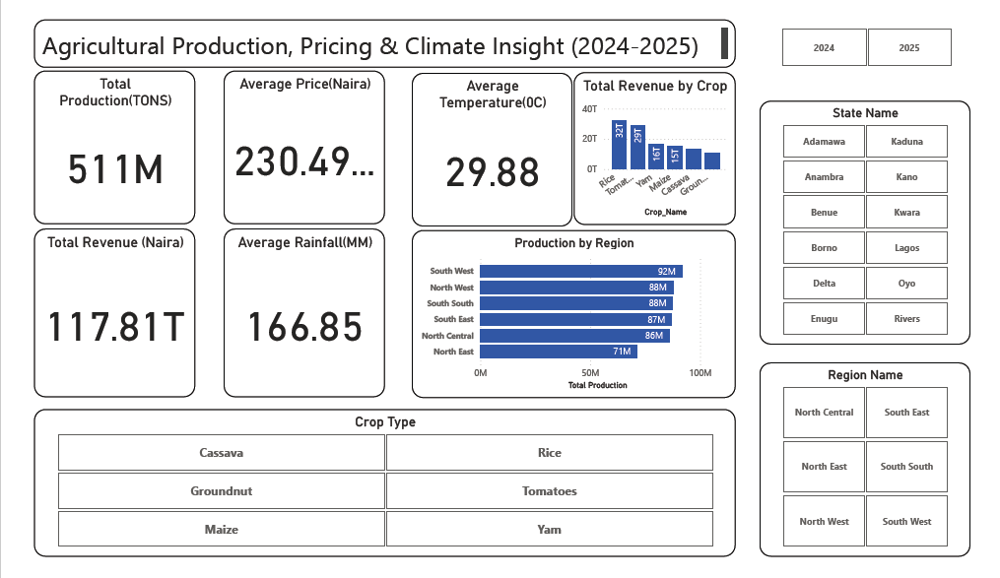 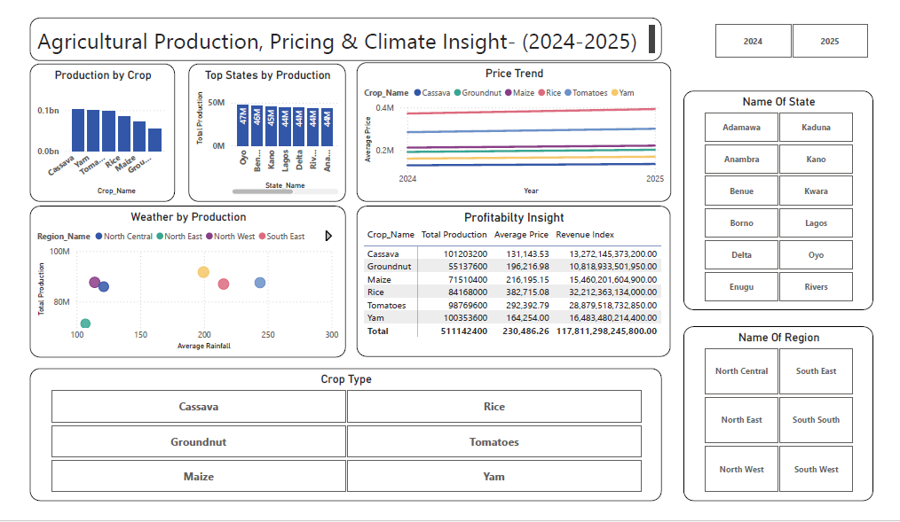

Nigerian Weather & Traffic Insight

Project:
Exploratory and analytical assessment of weather conditions and traffic congestion patterns.

Problem Solved:
Traffic congestion and weather conditions were analyzed separately, limiting understanding of how weather impacts road network performance.

Before (Metric):

Traffic and weather data analyzed in isolation

No clear visibility into weather-driven congestion patterns

After (Metric):

Linked weather and traffic datasets

Identified congestion trends under varying weather conditions to support mobility insights

Tools Used:
Power BI, QGIS, Excel

Dashboard / Report:
[View PDF](assets/Nigerian%20Traffic%20data.pdf)

Image Preview:
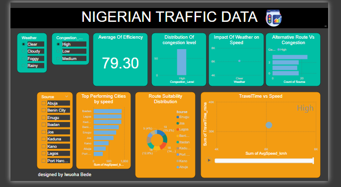  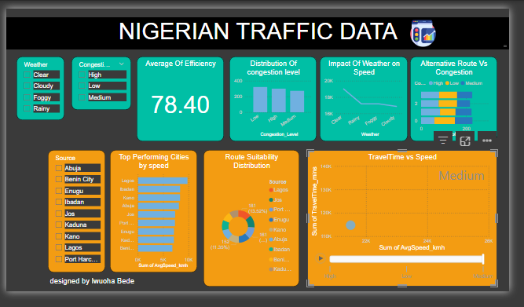 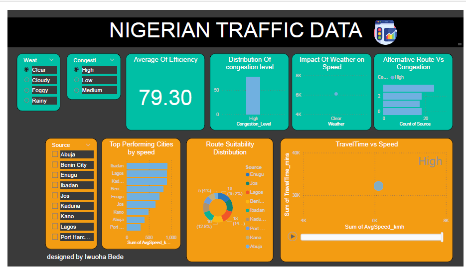

Lagos State 2024 Health Analysis Insight

Project:
State-level public health data analysis for Lagos State (2024).

Problem Solved:
Public health indicators were available but not synthesized into a form suitable for identifying trends or priority intervention areas.

Before (Metric):

Fragmented health indicators

Limited visibility into statewide patterns and disparities

After (Metric):

Consolidated and analyzed 2024 health indicators

Highlighted trends, disparities, and focus areas for planning and intervention

Tools Used:
Power BI, Excel

Dashboard / Report:
[View PDF](assets/LUTH%202024%20analysis.pdf)

Image Preview:
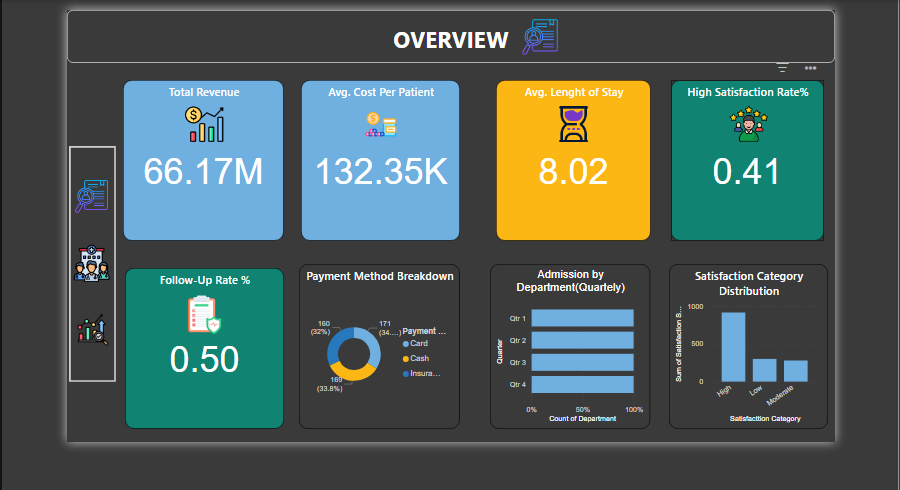 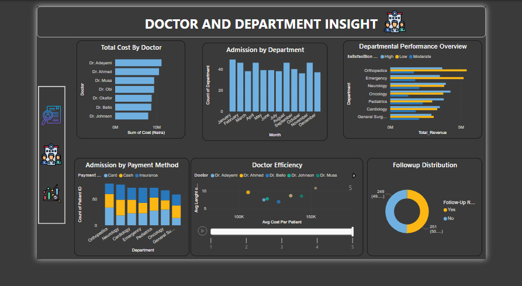 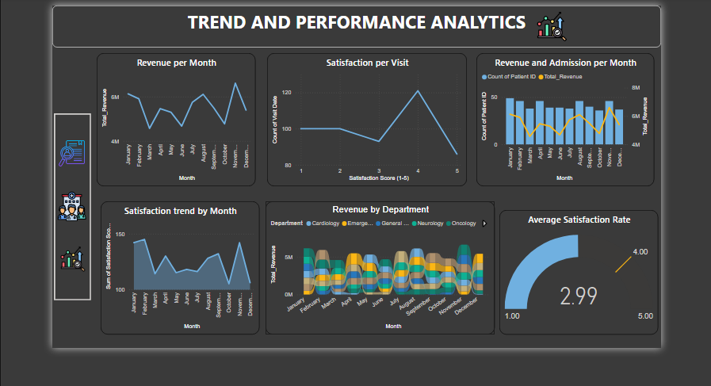

2016 Uber Data Insight

Project:
Urban mobility analysis using historical Uber trip data.

Problem Solved:
Raw trip-level data lacked clear insight into when and where ride demand was concentrated.

Before (Metric):

Large volumes of unstructured trip data

No summarized demand or spatial patterns

After (Metric):

Identified temporal demand trends and spatial ride distribution

Improved understanding of urban mobility behavior

Tools Used:
Python, Pandas, Power BI

Dashboard / Report:
[View PDF](assets/Uber%20Data%20set%202016.pdf)

Image Preview:
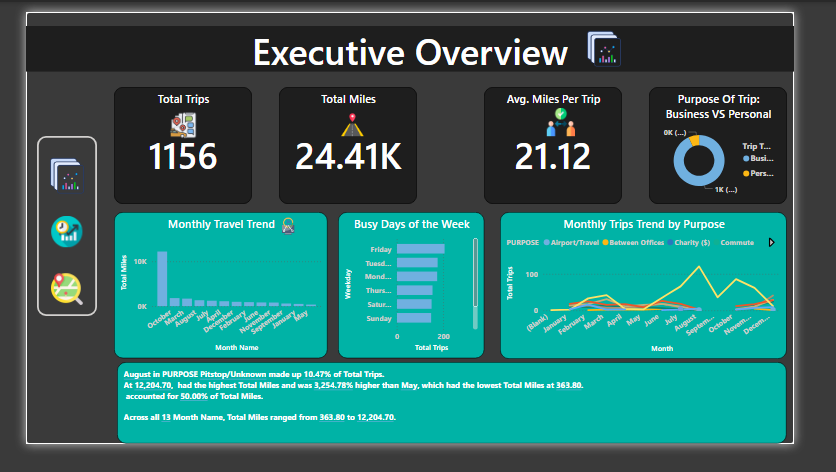 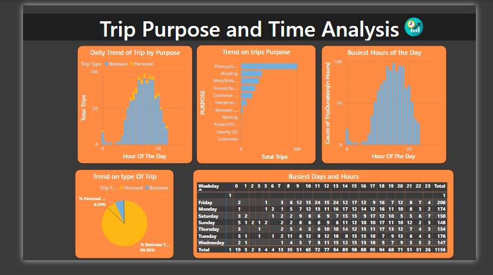 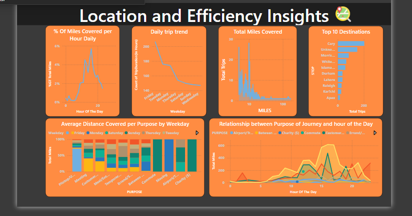

📂 Supporting Projects

Concise projects that demonstrate breadth, consistency, and applied analytics skills.

Power BI Capstone – Maven Electronics

Problem Solved:
Sales data existed without clear performance visibility across products and customers.

Before:

Raw sales data with limited analytical insight

After:

Built dashboards highlighting product performance, customer behavior, and sales trends

Dashboard / Report:
[View PDF](assets/mavenelectronics.pdf)

Ilorin Tourism Insight

Problem Solved:
Tourism data lacked spatial context for planning and development decisions.

Before:

Tourism data not spatially analyzed

After:

Visualized tourism patterns and attraction distribution for planning insights

Dashboard / Report:
[View PDF](assets/ilorin%20tourism%20insight.pdf)

Fitness & Competition Insight

Problem Solved:
Fitness and competition metrics were tracked but not analyzed for performance progression.

Before:

Isolated fitness tracking without trend analysis

After:

Identified performance trends and competitive patterns over time

Dashboard / Report:
[View PDF](assets/smart%20watch%20dsshboard.pdf)

Balaji Fast Food Insight

Problem Solved:
Sales transactions were recorded without demand or performance analysis.

Before:

Transaction data used only for record-keeping

After:

Extracted demand patterns and operational insights from sales data

Dashboard / Report:
[View PDF](assets/food%20insight.pdf)

Indian HR Data Insight

Problem Solved:
HR data did not clearly explain workforce or attrition trends.

Before:

Static HR tables with limited insight

After:

Identified attrition patterns and workforce trends

Dashboard / Report:
[View PDF](assets/hrdata.pdf)

Data Analytics — 15 Days Challenge

Problem Solved:
Analytics skills were practiced without consistent delivery pressure.

Before:

Isolated, ad-hoc analytics practice

After:

Completed 15 consecutive analytics tasks, improving speed and consistency

Dashboard / Report:
[View PDF](assets/15days%20challenge.pdf)

📬 Contact

📧 Email: bedeiwuoha@gmail.com

💻 GitHub: https://github.com/bedeiwu

🔗 LinkedIn: [(add link)](https://www.linkedin.com/in/bede-iwuoha-481361167?utm_source=share&utm_campaign=share_via&utm_content=profile&utm_medium=ios_app)
